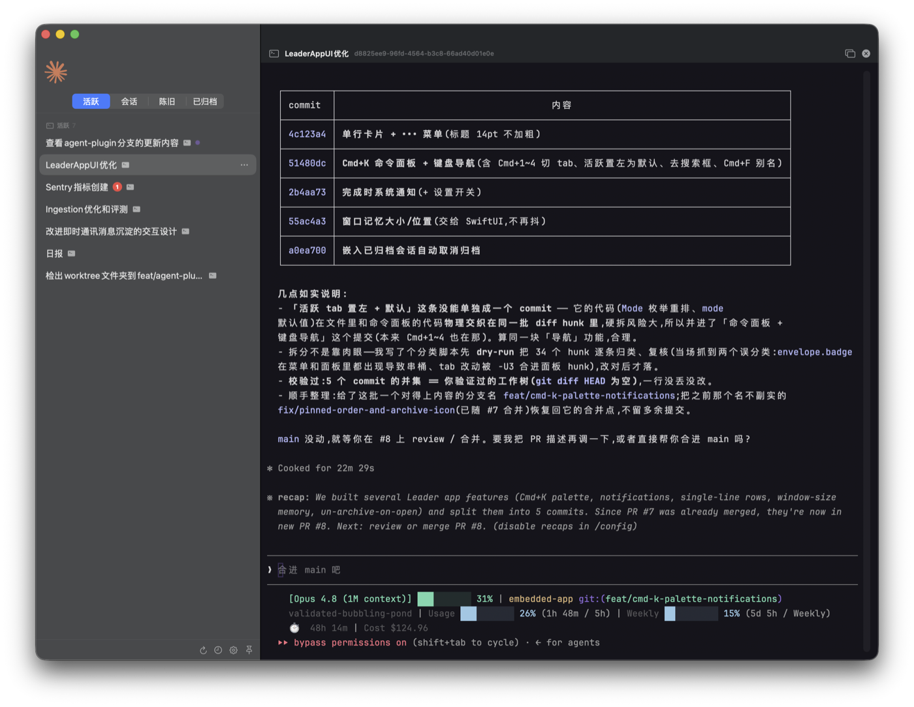

<div align="center">

# ✈️ Leader

**A native macOS cockpit for flying Claude Code, Codex, and Kimi Code CLI sessions — without the terminal-window pile.**


*One window. Every session. Click to switch.*

</div>

<p align="center"></p>

---

## Why

If you run Claude Code or Codex seriously, you end up with **a dozen sessions across
folders, git worktrees, and repos** — and two problems:

1. **You lose track.** Which sessions are still reasoning? Which finished and
   are waiting on you? Which died three days ago?
2. **Your desktop drowns.** Every session is another terminal window.

**Leader** replaces the window pile with a single native window: a session
**sidebar** on the left, and an **embedded terminal** on the right that runs
the real `claude --resume` *inside the app*. Click a session, work in it,
click the next one — opened sessions stay alive in the background for instant
switching.

> The UI is currently in Chinese (置顶 = pinned, 陈旧 = stale,
> 已归档 = archived). PRs for localization welcome.

## Features

### 🗂 A fleet board, not a session list
- Sessions are grouped **by folder** (or flat by recency — one click to
  toggle), **stale** (15 days+) tucked away, **archived** out of sight.
- **Pin** your daily drivers via right-click — they gather at the top under a
  single golden star. **Archive**, **rename** (Leader-only nickname), and
  **mark unread** are one right-click away.
- **Search everything**: title, nickname, last prompt, folder, branch — or
  paste a raw session id.

### 🖥 Terminals that live inside the app
- Click a row → the session runs **embedded** (SwiftTerm) in the main pane.
  Switching back is instant; background sessions keep running.
- **`+` / ⌘⇧O** mint a brand-new session — the session id is chosen up front
  (`claude --session-id`), so there is no race to discover it.
- **Double-tap ⌃Control** drops a quake-style **scratch terminal** over the
  main pane, already `cd`'d into the active session's working directory.
- Escape hatch: open any session in a real **kitty** window (for full-screen
  TUIs that don't scroll well embedded).

### ✨ Status you can read from across the room
- A session that is **actively reasoning shimmers** — its title dims and a
  bright band sweeps across it, ChatGPT-"Working…" style (driven by Claude
  Code lifecycle hooks, honors Reduce Motion).
- A session that **finished while you were elsewhere** gets a breathing purple
  dot until you look at it.
- A red **unread badge** (mail-style) for sessions you flag to revisit —
  opening the session clears it automatically.
- A quiet grey badge marks rows whose embedded process is alive (filled) or
  has exited (hollow).

### ⌨️ Keyboard-first

| Shortcut | Action |
| --- | --- |
| `↑` / `↓` / `Enter` | Navigate the sidebar / open the selected session |
| `⌘F` | Focus search (works even while a terminal has focus) |
| `⌘W` | Close the active embedded session (with confirm — the app stays) |
| `⌘⇧O` | Quick-open: type a directory (live completion), Enter starts a session there |
| `⌃⌃` (double-tap) | Toggle the scratch terminal |
| `⌘Q` | Quit (confirms if embedded sessions are still running) |

## Quick start

### Requirements

- **macOS 14+** (Apple Silicon or Intel — you build it locally)
- **Xcode Command Line Tools** — `xcode-select --install`
- **Claude Code** — `claude` on your `PATH`
- **Codex CLI** — `codex` on your `PATH` (only required for the Codex tab)
- **Kimi Code CLI** — `kimi` on your `PATH` (only required for the Kimi tab)
- Optional: [kitty](https://sw.kovidgoyal.net/kitty/) (`brew install --cask kitty`)
  — only the "open in kitty window" escape hatch needs it
- Optional: `brew install --cask font-jetbrains-mono`

### Build & install

```bash
git clone https://github.com/Coiggahou2002/leader.git
cd leader
./build.sh                      # -> dist/Leader.app (self-contained)
cp -R dist/Leader.app ~/Applications/
open ~/Applications/Leader.app
```

The Python backend is bundled **inside** the app bundle, so the installed app
has no dependency on the source tree.

### Updating

Leader updates itself via [Sparkle](https://sparkle-project.org): it checks an
appcast on GitHub Releases and installs new versions in place — click
**检查更新** (bottom bar) or wait for the scheduled check. Updates are verified
by an EdDSA signature, and Sparkle clears the download quarantine so they
relaunch without a Gatekeeper prompt.

> First launch of a fresh download still needs a one-time Gatekeeper bypass
> (right-click → **Open**, or `xattr -dr com.apple.quarantine Leader.app`) — the
> app is ad-hoc-signed, not notarized. Every subsequent auto-update is clean.

**Releasing (maintainers):** bump [`VERSION`](VERSION), then `./release.sh` —
it builds, zips, regenerates the EdDSA-signed appcast (signing key lives in your
login keychain), and publishes a GitHub Release. `SUFeedURL` points at the
`latest` release asset, so a running app sees the update automatically.

## Configuration

Everything has a sane default; override any key in `~/.config/leader/config.json`
(see `config.example.json`):

```jsonc
{
  "proxy": "127.0.0.1:6789",          // "" = none (default). Sets http/https/all_proxy for launched sessions
  "new_session_cwd": "~/dev/myrepo",  // folder the "+" button opens a new session in (default ~)
  "worktree_repos": ["~/dev/myrepo"], // git repos to show ahead/dirty + offer agent-worktree cleanup
  "claude_bin": "",                    // "" = resolve via `command -v claude`
  "codex_bin": "",                     // "" = resolve via `command -v codex`
  "kimi_bin": "",                      // "" = resolve via `command -v kimi`
  "kitty_bin": "/Applications/kitty.app/Contents/MacOS/kitty",
  "data_dir": "~/.claude/leader"       // where Leader stores pinned/archived/unread/nicknames
}
```

Terminal appearance (font, size, line height, soft Kaku-Dark palette) and the
proxy are also adjustable in-app via **Settings**.

## How it works

```
Leader.app (SwiftUI)
 ├─ Provider root          switch between separate Claude / Codex / Kimi fleets
 ├─ LeaderApp.swift        sidebar, buckets, search, shimmer/breathing status
 ├─ EmbeddedTerminal.swift SwiftTerm views + per-session process lifecycle
 ├─ QuakeTerminal.swift    double-tap-Ctrl scratch terminal
 └─ Resources/backend/     read-only Python, bundled into the app
     ├─ scan.py            read ~/.claude/projects/*.jsonl → bucket/sort (JSON)
     ├─ launch.py          kitty escape hatch (remote control, exact-window focus)
     ├─ archive.py / pin.py / unread.py / name.py   per-session flags & nicknames
     ├─ leader-hook.py     turn-lifecycle events → live "reasoning/done" status
     ├─ config.py          defaults + ~/.config/leader/config.json
     ├─ codex-scan.py      read ~/.codex session index + metadata (read-only)
     └─ kimi-scan.py       read ~/.kimi-code session index + metadata (read-only)
```

- **Your data is safe.** Leader treats `~/.claude/projects/*`, Codex's
  `~/.codex/{session_index.jsonl,sessions/*}`, and Kimi's
  `~/.kimi-code/{session_index.jsonl,sessions/*}` as **read-only**. It keeps its
  Claude-specific state files under `~/.claude/leader`; conversation transcripts
  are never modified.
- **Codex is intentionally narrow in this first release:** its tab lists local
  saved sessions and opens `codex resume <session-id>` in the embedded terminal.
  It does not infer lifecycle state or reuse Claude hooks, and preserves Codex's
  normal approval and sandbox policy.
- **Kimi is intentionally narrow in this first release:** its tab lists local
  saved sessions and opens `kimi -S <session-id>` in the embedded terminal.
  It does not infer lifecycle state or reuse Claude hooks, and preserves Kimi's
  normal approval and sandbox policy.
- **Live status** comes from Claude Code hooks: Leader registers
  `leader-hook.py` on `UserPromptSubmit` / `Stop` / `SessionEnd` (merged via
  `--settings`, without replacing your own hooks) and watches the event
  directory with FSEvents — sub-second shimmer, no polling lag.
- **Env hygiene:** a `claude` started with `CLAUDECODE` / `CLAUDE_CODE_*` /
  `CODEX_COMPANION_*` in its environment runs as a *nested child session* and
  does not persist its transcript. Leader strips these before every launch.
  Keep that in mind if you hack on `launch.py`.

## Known issues / roadmap

- **kitty `+` sid capture:** in the kitty escape-hatch path, a new session's id
  is unknown until its first message lands; `launch.py` polls up to ~12 s to
  map the window. Clicking `+` twice quickly can mis-map a windows.json entry
  (no conversation loss). Planned fix: identify windows at click time via
  `kitty @ ls` cmdline matching — deterministic and race-free.
- UI localization (English) is not done yet.

## Contributing

Issues and PRs are welcome. The codebase is deliberately small: one SwiftUI
file for the UI, a few dependency-free Python scripts for data. Please keep
that spirit — no frameworks for the backend, no conversation-data writes, and
run `./build.sh` before submitting.

## License

Not yet licensed — a proper open-source license (likely MIT) is on the way.
Until then, all rights reserved.
