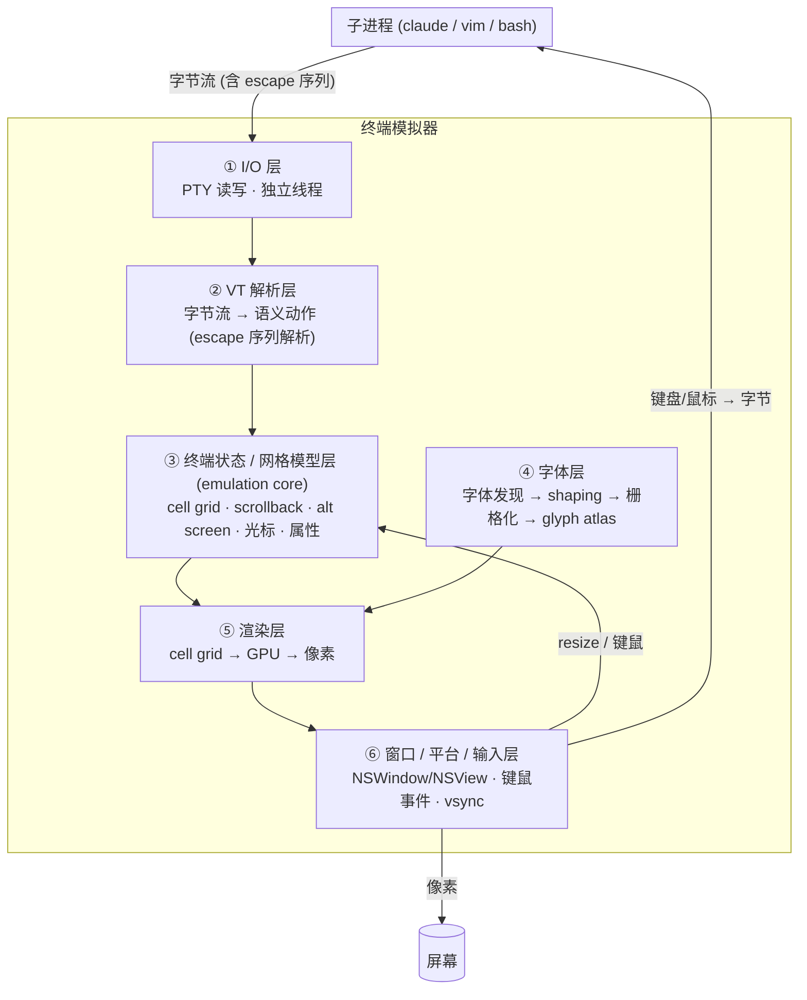

# 终端渲染:从字节到像素

> 一篇给工程师的系统讲解 —— 即使你完全不懂终端渲染,只要有计算机基础,也能从头读懂"现代终端为什么渲染得这么好、老终端差在哪、各层有哪些开源件可用",最后落到我们 Leader 嵌入式终端遇到的**重影/残影**问题该怎么修。

本文是一次具体工程问题(SwiftTerm 嵌入 claude 后,全屏 TUI 滚动 / 窗口 resize 时画面叠帧;以及 resize 时历史不重排)触发的调研产物,但刻意写成一篇**可独立阅读的科普 + 决策文档**。所有关键论断都附了来源链接(见文末)。

---

## 0. 一分钟先建立心智模型

一个终端模拟器(terminal emulator)本质上只做一件事:

```
子进程(claude / bash / vim)  --写字节-->  终端  --画-->  屏幕上的字符网格
                              <--送键盘/鼠标--
```

它**不是**一个"文本框"。它是一个**状态机 + 渲染器**:

- 子进程往一根叫 **PTY(pseudo-terminal,伪终端)** 的管道里吐**字节流**;
- 这些字节里既有普通字符("a"、"中"),也有**控制序列(escape sequence)**,比如"把光标移到第 3 行第 5 列""把后面的字染成红色""清屏""切换到全屏缓冲区";
- 终端把字节流解析成一个**二维字符网格(cell grid)**:每个格子(cell)记着"这里是哪个字符、什么前景色、什么背景色、是否加粗/下划线";
- 然后终端把这个网格**画成像素**。

全文要回答的核心问题就藏在最后这步"**画成像素**"里 —— 新老终端的差距,90% 在这一步。

---

## 1. 基础概念词典

读后面任何一节前,先把这些词的直觉建立起来。每个词都给"是什么 + 为什么存在"。

### 1.1 字符相关:codepoint / grapheme / glyph

这三个层层递进,极易混淆:

| 名词 | 含义 | 例子 |
|---|---|---|
| **codepoint(码点)** | Unicode 里一个编号 | `U+0041`='A';`U+4E2D`='中';emoji 肤色是另一个码点 |
| **grapheme(字位/用户感知字符)** | 用户眼里"一个字" | 👨‍👩‍👧 是 1 个 grapheme,但由多个 codepoint(加零宽连接符 ZWJ)拼成 |
| **glyph(字形)** | 字体文件里实际画出来的一个图形 | "fi" 连字(ligature)是 1 个 glyph,却对应 2 个码点 |

**为什么重要**:终端的"格子"是按"显示宽度"排的(一个汉字占 2 格,一个 ASCII 占 1 格),而"码点数""字形数"都不等于"格子数"。这层错位是终端处理 CJK、emoji、连字的复杂度来源。

### 1.2 Shaping(字形整形)

**输入**:一串码点 + 一个字体。**输出**:一串"该用哪些 glyph、各自摆在什么位置"。

它要处理:连字(`f`+`i`→`fi`)、字偶距(kerning,`AV` 两个字母靠近一点)、阿拉伯语的连写、emoji 组合。这是一门复杂的排版学问,所以几乎**没人自己写**,大家都用一个叫 **HarfBuzz** 的开源库。

> 终端里通常会**关掉**大部分 shaping 特性(等宽字体要求每格固定宽度),但仍需要 shaping 来正确处理连字字体、CJK、emoji。

### 1.3 Rasterization / Raster(栅格化)

字体文件里的字形是**矢量轮廓**(贝塞尔曲线描述的形状,可无限缩放)。但屏幕是**像素网格**。把"矢量轮廓"在某个字号下算成"一块带灰度/颜色的像素位图(bitmap)",这个过程叫**栅格化(rasterization)**,得到的位图常被称作 **raster** 或 **alpha mask(透明度掩码,灰度图,告诉你每个像素该多黑)**。

干这活的开源库:**FreeType**(跨平台)。macOS 上系统自带 **CoreText**(底层是 Core Graphics)也能干,而且更懂苹果的字体/字距。

> 一句话:**shaping 决定"画哪些字形、摆哪",rasterization 决定"每个字形长成什么像素"**。

### 1.4 GPU API(图形接口)

CPU 擅长串行逻辑,GPU 擅长"同时对成千上万个像素做同样的事"。要让 GPU 干活,得通过一套**图形 API** 给它下指令。主流的:

| GPU API | 平台 | 备注 |
|---|---|---|
| **OpenGL** | 跨平台老牌 | macOS 已弃用(但仍能跑),Kitty 仍坚持用它 |
| **Metal** | 苹果原生 | macOS/iOS 性能最好的路径 |
| **Vulkan** | 跨平台新标准 | Linux/Windows |
| **DirectX 11/12** | Windows | |
| **wgpu** | 抽象层(Rust) | 写一份代码,自动映射到 Metal/DX12/Vulkan/GL —— WezTerm/Rio 用它 |

**关键认知**:几乎没有终端"自研 GPU API"。它们要么直接调 Metal/OpenGL,要么站在 `wgpu` 这种抽象层上。自研的是**怎么用这些 API 去画终端**。

### 1.5 Texture / quad / instanced rendering / draw call

理解现代终端渲染必须懂这四个 GPU 词:

- **Texture(纹理)**:GPU 显存里的一张图片。
- **Quad(四边形)**:GPU 画东西的基本单元,两个三角形拼成的矩形。屏幕上一个字符格 = 一个 quad,贴上对应字形的纹理。
- **Draw call(绘制调用)**:CPU 让 GPU "画一批东西"的一次命令。**draw call 越少越快**(每次调用都有固定开销)。
- **Instanced rendering(实例化渲染)**:一种"用一次 draw call 画一万个相似 quad"的技术。你告诉 GPU:"这是一个格子模板,这是 80×40 个格子各自的(位置、字形索引、颜色),你自己批量画完。"

> 老终端:**每个脏行调一次 CPU 绘制**。现代终端:**整屏所有格子,一两次 draw call,GPU 并行铺完**。这是性能差距的物理来源。

### 1.6 Glyph atlas / sprite sheet(字形图集)

游戏里有个经典技巧叫 **sprite sheet(精灵图集)**:把所有小图标拼到一张大图里,用的时候按坐标取子区域,避免反复加载。

终端把它搬过来:**每个独特字形只栅格化一次,塞进一张大的 GPU 纹理(就是 glyph atlas)**;之后每个格子只存一个"图集里的索引(sprite index)"。画的时候,shader(GPU 上的小程序)拿索引去图集里取那块像素贴上。

**收益**:渲染开销只跟**屏幕上有多少种不同字形**有关,跟字符总数无关。屏幕铺满 3000 个"中"字,字形栅格化只发生 1 次。

### 1.7 Damage / dirty tracking vs Immediate-mode(增量重绘 vs 全量重绘)

这是**本文最重要的概念**,直接对应我们的残影 bug。

- **Damage / dirty tracking(脏区追踪)**:渲染器记录"上一帧之后,哪些格子/哪些行变了",**只重画变的部分**,省 CPU/GPU。
- **Immediate-mode full redraw(全量重绘)**:每帧都**从权威的 cell 网格,把整屏所有格子重新画一遍**,不管变没变。

直觉上 dirty tracking 更"聪明",但它有个致命问题:**一旦"哪里变了"算错了,没被重画的区域就残留上一帧的像素**。而"整屏滚动""窗口 resize"恰好是最难算对脏区的两个场景 —— 这就是叠帧/残影的来源。

> **全量重绘天生没有残影**,因为每帧都从"真相源"重铺,**根本不存在"上一帧没擦掉的旧像素"**。代价是没变也画,但现代 GPU 终端用两招抵消:① 只在状态变脏时才出帧(空闲就 idle),② vsync 把帧率封顶在屏幕刷新率。

记住这句话,第 6 节会用它解释我们的 bug。

### 1.8 终端语义词:alt screen / scrollback / soft-wrap vs hard-wrap / reflow

- **Scrollback(回滚缓冲)**:你往上滚能看到的历史输出。
- **Alternate screen(备用屏 / alt screen)**:全屏程序(vim、less、claude 的 `/tui fullscreen`)会切到一个**独立的、没有 scrollback 的定长缓冲区**;退出时这块内容丢弃,回到原来的主屏。这就是"为什么在 vim 里滚不动终端历史"。
- **Soft-wrap(软换行)**:你打的一行字超过了终端宽度,**终端自己**把它折到下一行,并打一个"这两行其实是同一逻辑行"的标记(`isWrapped`/`WRAPLINE`)。
- **Hard-wrap(硬换行)**:**程序自己**算好宽度、主动吐了一个换行符 `\n`。终端收到的是**两条互相独立的逻辑行**,没有"它俩是一句"的标记。
- **Reflow(重排)**:改变窗口宽度时,把文本按新宽度重新折行。**关键限制:终端只能 reflow 软换行;硬换行无从得知"原本是一句",永远无法重排。** 这条是第 6 节我们"历史不重排"问题的根。

### 1.9 VT / ANSI escape

**VT**(VT100/VT220,DEC 公司 1970-80 年代的物理终端型号)定义了那套控制序列的"方言",至今所有终端都在兼容它(常叫 **ANSI escape sequence**)。"VT 解析"就是把字节流里的 `ESC[31m`(染红)这类序列解析成语义动作。

---

## 2. 架构分层:终端的六层模型

把上面的概念串起来,一个终端可以清晰地切成**六层**。理解这个分层,是看懂"新旧差异在哪层""哪些层有现成开源件"的骨架。



逐层说明:

| 层 | 职责 | 关键产物 | 类比 |
|---|---|---|---|
| **① I/O** | 从 PTY 读子进程输出、把键鼠写回去 | 原始字节 | 网卡 |
| **② VT 解析** | 把字节流解析成"移光标/染色/写字符"等动作 | 动作序列 | 编译器前端(parser) |
| **③ 终端状态核(emulation core)** | 维护那个二维 cell 网格 + scrollback + alt screen + 光标 | **权威的 cell grid** | 文档的内存模型(DOM) |
| **④ 字体层** | 找字体→shaping→栅格化→塞进 atlas | glyph atlas + 每格的 sprite 索引 | 字模仓库 |
| **⑤ 渲染层** | 读 cell grid,用字体层的 atlas,画成像素 | 屏幕像素 | 浏览器渲染引擎 |
| **⑥ 窗口/平台/输入** | 开窗口、拿键鼠、vsync 出帧 | 事件 + 呈现 | 操作系统外壳 |

**两个最值得记住的边界**:

1. **③ 和 ⑤ 是可以分离的**。③(状态核)产出 cell 网格;⑤(渲染器)消费它。一个好的架构里,你可以**保留 ③,换掉 ⑤**。这正是我们修残影的钥匙(第 6/7 节)。
2. **④+⑤(字体+渲染)是新旧终端拉开差距的地方**;①②③(IO/解析/状态)各家其实都差不多成熟。

---

## 3. 老式 vs 现代:每一层到底差在哪

"现代 GPU 终端"(Alacritty / Kitty / WezTerm / Ghostty)和"老式终端"(Terminal.app、xterm、早期 iTerm2,以及我们用的 **SwiftTerm 默认渲染器**)的差异,几乎全集中在 ④⑤,外加 ①② 的一些工程优化。

```
                老式终端                          现代 GPU 终端
─────────────────────────────────────────────────────────────────────
② VT 解析     逐字节 if/switch                   SIMD 向量化批量解析
              (吞吐受限)                          (cat 大文件飞快)

① I/O 线程    与渲染同线程                       独立 I/O 线程
              (刷屏会卡输入)                      (刷屏不卡渲染/输入)

④ 字体        每帧用 CPU 重新栅格化/排版          每个字形栅格化一次 → 存 GPU atlas
              (CoreText 逐行画 NSAttributedString) (开销只跟"独特字形数"有关)

⑤ 渲染 ★★★    CPU 逐"脏行"绘制 (dirty-rect)       GPU: 每 cell 一个 instanced quad,
              ← 残影的根源                         整屏一两次 draw call,
                                                  ★ 每帧从 cell grid 全量重铺 ★
                                                  ← 残影在物理上不可能发生
```

### ⑤ 渲染层:那个决定性的差异

**老式(含 SwiftTerm `CoreGraphicsRenderer`)**:每帧只重画它"以为变了"的行,每行用 CoreText 把 `NSAttributedString` 画一遍。两个问题:
- **性能**:开销随可见格子数涨,属性逐格变化时尤其慢(SwiftTerm 的 [issue #202](https://github.com/migueldeicaza/SwiftTerm/issues/202) 明确承认这点)。
- **正确性**:脏区算错就残留旧像素 → 残影。

**现代**:glyph atlas + 每 cell 一个 instanced quad,**整屏每帧从权威 cell grid 全量重铺**。Alacritty 作者原话:

> "Alacritty 不关心只重画必要的部分。**整屏每帧重画,因为太便宜了。**"
> —— [Announcing Alacritty](https://jwilm.io/blog/announcing-alacritty/)

### 这件事的"正典故事":refterm vs Windows Terminal

2021 年,Casey Muratori 为了反驳"高性能终端很难做"的说法,写了个参考实现 **refterm**:一个最朴素的 tile renderer(把屏幕当格子,glyph 进 atlas,每帧全量重铺),在最坏情况下仍跑到几千 FPS,比当时的 Windows Terminal 快几个数量级。他的核心论点正是本文的主线:

> **"整屏全量重画"比"维护正确的 damage tracking"更简单、更快,而且天生正确。**

参见 [cmuratori/refterm](https://github.com/cmuratori/refterm) 与那场著名争论([Lobsters](https://lobste.rs/s/odxvsl/it_takes_phd_develop)、[HN](https://news.ycombinator.com/item?id=31284419))。

> ⚠️ **反方观点(必须给)**:全量重绘不是没有代价。Linux 上的 **foot** 终端**故意**做 damage tracking,为的是省电(笔记本/嵌入式场景下,空闲时不重画很重要,见 [foot Performance wiki](https://codeberg.org/dnkl/foot/wiki/Performance))。所以"全量 vs 增量"是真实的工程取舍。但**对"消除残影正确性"这个目标,全量重绘是稳妥的一边**;而且现代终端的"全量"其实是"脏了才全量重画一帧 + vsync 封顶",并非持续烧 GPU。

### 一个反直觉的现实:benchmark ≠ 体感

别被"快"误导。Ghostty 作者 Mitchell Hashimoto 自己说:Ghostty 在**合成 benchmark 上"相当差"**,而且**输入延迟"从没认真测过/优化过"**([discussion #4837](https://github.com/ghostty-org/ghostty/discussions/4837))。"渲染好"的真正来源是**正确(不残影)+ GPU 原生 + 低抖动**,而不是某个英雄延迟数字。这对我们是好消息:**我们要的是"正确",而正确恰恰是全量重绘几乎免费送的**。

---

## 4. 生态与工具:每一层有哪些现成件

这一节是"造终端的零件清单"。**规律先行:GPU API、shaping、栅格化、字体发现这几层,大家都用现成开源件;真正各家自研、也真正拉开差距的,是 ④ 的 glyph atlas + ⑤ 的渲染管线 + ③ 的 cell 模型。**

### 4.1 按层的开源件清单

| 层 | 可用开源件 | 谁在用 |
|---|---|---|
| ⑤ GPU API | OpenGL / Metal / Vulkan / DirectX / **wgpu**(抽象层) | Kitty=GL;Ghostty=Metal;WezTerm/Rio=wgpu |
| ④ shaping | **HarfBuzz**(事实标准) | 几乎所有终端 |
| ④ 栅格化 | **FreeType**(跨平台)/ **CoreText**(macOS) | FreeType=Linux;CoreText=mac |
| ④ 字体发现 | **fontconfig**(Linux)/ CoreText(mac)/ DirectWrite(Win) | 同上 |
| ④ atlas 装箱 | `guillotiere`、自写 bin-packer | WezTerm 用 guillotiere;Ghostty 自写 |
| ③ VT 核(可嵌入) | `libvte`、`libvterm`、**`alacritty_terminal`**(Rust)、`wezterm-term`+`termwiz`(Rust)、**SwiftTerm**(Swift)、**`libghostty-vt`**(Zig/C) | 见 4.3 |
| 渲染器(可单独用) | `sugarloaf`(Rio 的,wgpu)、自写 | Rio |
| 整机可嵌入(核+渲染) | **SwiftTerm**(Swift 全套)、**libghostty surface API**(不稳定) | 见 4.3 |

### 4.2 市面终端逐个拆解(case study)

把每个真实终端按"它在各层选了什么"摆开,你会立刻看清谁是谁:

| 终端 | 语言 | GPU API | shaping | 栅格化 | ⑤ 渲染策略 | 核可嵌入? |
|---|---|---|---|---|---|---|
| **Terminal.app**(苹果自带) | ObjC | 无(CPU) | CoreText | CoreText | CPU 绘制 | 否 |
| **iTerm2** | ObjC | Metal(可选) | CoreText | CoreText | Metal,但**开连字就退回 CPU** | 否 |
| **Alacritty** | Rust | OpenGL | (极简,弱 shaping) | FreeType/CoreText | **全量重绘 + atlas + instanced** | ✅ `alacritty_terminal` |
| **Kitty** | C+Python | OpenGL | HarfBuzz | FreeType/CoreText | atlas + instanced(每 cell 一 quad) | ❌ 与 Python 死耦合 |
| **WezTerm** | Rust | wgpu/OpenGL | HarfBuzz | FreeType | atlas + per-line `seqno` damage | ✅ `wezterm-term`/`termwiz` |
| **Ghostty** | Zig | **原生 Metal**/GL | 自写 CoreText shaper / HarfBuzz | CoreText/FreeType | atlas + damage 快照 | ⚠️ 仅 `libghostty-vt`(无渲染) |
| **Rio** | Rust | **wgpu** | HarfBuzz | FreeType | `sugarloaf` 渲染器 | 部分(`rio-backend` 等) |
| **foot**(Linux) | C | (软件/Wayland) | HarfBuzz | FreeType | **故意 damage tracking 省电** | 否 |
| **SwiftTerm**(我们) | Swift | 默认无(CoreGraphics) | CoreText | CoreText | **CPU 逐脏行**(=老式) | ✅ Swift 全套,且**渲染器可插拔** |

几个值得记住的点:

- **iTerm2 的尴尬**:有 Metal,但开连字就关掉 Metal 退回 CPU —— Ghostty 是少数"开连字还能用 Metal"的终端([Mitchell 访谈](https://changelog.com/podcast/622))。
- **Alacritty 的取舍**:它快、可嵌入,但**shaping 弱**(对复杂连字/某些 CJK 排版支持不如 Kitty/WezTerm)。它的 `alacritty_terminal` 是目前**最适合被嵌入的 Rust VT 核**,且暴露了 cell `Grid` 和 `Term::damage()` API([docs.rs](https://docs.rs/alacritty_terminal))。
- **Kitty 不可嵌入**:C 核与它自己的 Python 层、GLFW 窗口死耦合,DeepWiki 的源码结论是"不是可复用库,而是 kitty 的内置后端"。
- **SwiftTerm 的真相**:它的**渲染层是老式的(CPU 逐脏行)**,这是残影根源;但它的 **emulation 核是成熟的,而且渲染器是可插拔的**(有 `TerminalRenderer` 协议)。这决定了我们的修法。

### 4.3 可嵌入性专题:libghostty 的冷水

你可能听说"Ghostty 的 libghostty 能让任何 app 嵌入一个高质量终端"。**这里有个关键陷阱,必须分清两个 libghostty**:

| | `libghostty-vt`(公开,在稳定中) | 完整 surface API(内部,不对外稳定) |
|---|---|---|
| 干什么 | VT 解析 + 终端状态(③ 层) | 完整 app 生命周期 + **把 Metal 渲染进你给的 `NSView`** |
| 含 GPU 渲染? | **否** | **是** |
| 状态 | 公开 alpha,MIT,预计 ~2026 中 tag 稳定 | 明确"**未对第三方稳定**",随版本大改 |

- 今天你能用 `libghostty-vt` 拿到 Ghostty 的"**大脑**"(解析+状态),但**得自己写渲染**(官方 demo [Ghostling](https://github.com/ghostty-org/ghostling) 正是这么干的:vt-only + 自带 Raylib renderer)。
- **带 GPU 渲染的那块 surface API**,powers Ghostty 自己的 mac app 和 OrbStack —— OrbStack 证明能嵌,但**要承受 API 随时大改**。
- 结论:**今天拿不到"稳定的、第三方可用的 Ghostty GPU 渲染视图"**。它是未来,不是现在。来源:[Libghostty Is Coming](https://mitchellh.com/writing/libghostty-is-coming)。

---

## 5. 为什么全屏 TUI(claude `/tui fullscreen`)在好终端里很顺

我们的 bug 之一发生在全屏 TUI 场景,所以单独讲讲好终端是怎么处理的。四点叠加:

1. **alt screen 是独立的、无 scrollback 的定长网格**。全屏 app 是每个 cell 的唯一作者,redraw 边界明确、可预测。
2. **per-line damage(如 WezTerm 的 `seqno`)**:发完整 GPU 帧,但只对变了的 cell 重建 quad。既快又(因为是全量铺)不残影。
3. **resize 时故意不 reflow alt screen**,只调网格尺寸,让 app 自己响应 `SIGWINCH` 重画(Kitty 0.45.0、Ghostty 都这么做)。避免"终端重排 + app 又重画"打架闪烁。
4. **滚轮在 alt screen 里翻译成方向键**(app 没开 mouse reporting 时),所以 less/vim 能用滚轮。

> 这解释了我们之前的两个现象:① 全屏滚动残影,是因为 SwiftTerm 的渲染器是"增量 + CPU 逐行",不是"全量重铺";② 全屏里滚轮要靠"翻译成方向键 / 转发鼠标事件"才动 —— 这部分我们已经在 `EmbeddedTerminalView.handleScroll` 里手动实现了。

---

## 6. 回到我们的问题:重影/残影到底出在哪一层

现在用上面的分层,精确定位我们 Leader 嵌入式终端的两个症状:

```
症状 A:全屏 TUI 滚动 / 窗口 resize 时,旧帧像素残留、叠帧 (重影/残影)
   └── 出在 ⑤ 渲染层
       SwiftTerm 默认 CoreGraphicsRenderer 是"增量 + CPU 逐脏行":
       claude 异步流式重绘 → 脏区算不全 → 没被重画的格子残留旧像素
   ✅ 可修:这是渲染层 bug,换/改渲染器即可,不必动 ③ 状态核

症状 B:resize 后,往上滚的历史没有按新宽度重排
   └── 出在 ③ 状态核的"通用限制" + 上游 app 的选择
       claude 把自己的输出在旧宽度下硬换行(吐 \n)写进 scrollback;
       硬换行无"原本是一句"标记 → 任何终端都无法 reflow
   ❌ 不可单方修:WezTerm/Kitty/Ghostty/Alacritty 全都一样
       唯一正解在上游:让 claude 吐软换行长行 (anthropics/claude-code#43113)
```

两条的性质完全不同,务必分开看:

- **症状 A 是我们能修的**,而且修法清晰(下一节)。它**不是** SwiftTerm 状态核的问题,只是它默认渲染器太老。
- **症状 B 是全行业通用限制**。我上一轮验证过:[WezTerm discussion #5539](https://github.com/wezterm/wezterm/discussions/5539)、[Alacritty #4419](https://github.com/alacritty/alacritty/issues/4419)、[Kitty 文档](https://deepwiki.com/kovidgoyal/kitty/2.5-terminal-buffer-data-structures) 都确认硬换行无法 reflow;Anthropic 自己的 [claude-code#43113](https://github.com/anthropics/claude-code/issues/43113) 就是在推动 claude 改吐软换行。**换任何终端核都修不了它**,只能等上游或我们把宽度固定。

---

## 7. 我们能怎么做:方案与路线

既然症状 A 是渲染层(⑤)的问题,而 SwiftTerm 的渲染器**可插拔**、emulation 核(③)又是成熟的,结论很自然:**不抛弃 SwiftTerm,换掉它的渲染层。**

### 路线矩阵

| 路线 | 修残影A | 修reflowB | 渲染达 WezTerm 级 | 风险 | 工作量 |
|---|---|---|---|---|---|
| **(i) 留 SwiftTerm + 全量重绘 / Metal 渲染器** | ✅ 构造上根治 | ❌(通用) | ✅ atlas+instanced | **低** | **低-中** |
| (ii) `alacritty_terminal`(Rust 核)+ 自写 Metal 渲染器 + FFI | ✅ | ❌ | ✅(全自造) | 中-高 | **高** |
| (iii) 等/嵌 libghostty 渲染视图 | ✅(将来) | 部分 | ✅(原生 Metal) | **高(API 不稳)** | 将来低 |

- **(i) 是首选**。SwiftTerm 有 `TerminalRenderer` 协议,社区已有一个 **Metal 渲染器([issue #479](https://github.com/migueldeicaza/SwiftTerm/issues/479))**,做的正是 atlas + instanced 全量重绘,作者称**已在生产 app(HiveTerm)跑通**并愿意 PR。省了换语言/写 FFI/重写 PTY 的全部成本。
- **(ii) 是升级逃生口**:只有当 SwiftTerm 的**状态核**(不是渲染器)出现我们无法容忍的正确性缺陷时,才值得上。`alacritty_terminal` 是最成熟的可嵌入 Rust VT 核,但你要自己写 Metal 渲染器 + FFI + PTY 胶水。
- **(iii) 是未来,不是现在**:libghostty 的 GPU 渲染视图对第三方还不稳定。

### 先做最便宜的验证(强烈建议的第一步)

不要一上来就写 Metal。**先在现有 CoreGraphics 渲染器里强制"每帧全量重画"**(画整屏每一行、无视 dirty-line 标记),验证那个核心论断:

> 如果全屏滚动 + resize 的残影**消失**了 → 证明"全量重绘根治残影"成立,只是 CPU 占用升高。那么"是否值得再上 #479 的 Metal 版(把 CPU 成本也降下来)"就变成一个**清晰的性价比决策**,而不是赌。

这个实验大概几十行、半天内见分晓、零架构风险。我们其实已经朝这个方向走了一半:`EmbeddedTerminalView.setNeedsDisplay` 已经在 alt-screen / resize 窗口内"提升为整屏重绘",效果是**可见帧不残影**(你已验证)。把它从"特定场景提升"扩成"渲染器层面的常态全量重画",就是这个实验。

---

## 8. 术语速查表

| 词 | 一句话 |
|---|---|
| PTY | 子进程与终端之间的字节管道 |
| escape sequence / VT | 字节流里"移光标/染色/清屏"等控制指令(VT100 方言) |
| codepoint / grapheme / glyph | Unicode 编号 / 用户感知的一个字 / 字体里实际画的图形 |
| shaping | 码点串 → "用哪些字形、摆哪"(HarfBuzz) |
| rasterization / raster | 矢量字形 → 像素位图(FreeType / CoreText) |
| GPU API | 给 GPU 下指令的接口(OpenGL/Metal/Vulkan/wgpu) |
| texture / quad / draw call | 显存图片 / 画矩形的基本单元 / 一次"画一批"命令 |
| instanced rendering | 一次 draw call 画上万个相似 quad |
| glyph atlas | 把所有独特字形拼进一张 GPU 大纹理,格子只存索引 |
| damage / dirty tracking | 只重画变了的部分(省资源,但易残影) |
| immediate-mode full redraw | 每帧从 cell 网格全量重铺(天生不残影) |
| cell grid | 终端的权威二维字符网格(状态核产出) |
| scrollback / alt screen | 历史回滚缓冲 / 全屏程序用的无历史定长缓冲 |
| soft-wrap / hard-wrap | 终端自动折行(可 reflow)/ 程序吐 `\n`(不可 reflow) |
| reflow | 改宽度时按新宽重新折行(只对软换行有效) |
| vsync / frame pacing | 把出帧节奏同步到屏幕刷新率,防撕裂 |

---

## 9. 参考来源

**渲染原理 / 正典争论**
- [Announcing Alacritty(全量重绘设计)](https://jwilm.io/blog/announcing-alacritty/)
- [cmuratori/refterm](https://github.com/cmuratori/refterm) · [Windows Terminal "PhD" 争论(Lobsters)](https://lobste.rs/s/odxvsl/it_takes_phd_develop) · [HN 讨论](https://news.ycombinator.com/item?id=31284419)
- [foot Performance wiki(故意 damage tracking 省电)](https://codeberg.org/dnkl/foot/wiki/Performance)

**各终端架构**
- Kitty:[performance](https://sw.kovidgoyal.net/kitty/performance/) · [源码分析(DeepWiki)](https://deepwiki.com/kovidgoyal/kitty/2.3-screen-and-terminal-display) · [buffer/reflow](https://deepwiki.com/kovidgoyal/kitty/2.5-terminal-buffer-data-structures)
- WezTerm:[term/README(可嵌入)](https://github.com/wez/wezterm/blob/main/term/README.md) · [front_end 配置](https://wezterm.org/config/lua/config/front_end.html) · [reflow 规则 discussion #5539](https://github.com/wezterm/wezterm/discussions/5539) · [termwiz docs](https://docs.rs/termwiz/latest/termwiz/)
- Ghostty:[Libghostty Is Coming](https://mitchellh.com/writing/libghostty-is-coming) · [vt.h 头文件](https://github.com/ghostty-org/ghostty/blob/main/include/ghostty/vt.h) · [Ghostling demo](https://github.com/ghostty-org/ghostling) · [benchmark 态度 #4837](https://github.com/ghostty-org/ghostty/discussions/4837) · [Mitchell 访谈](https://changelog.com/podcast/622)
- Alacritty 核:[alacritty_terminal docs](https://docs.rs/alacritty_terminal) · [damage API](https://github.com/alacritty/alacritty/blob/master/alacritty_terminal/src/term/mod.rs) · [reflow #4419](https://github.com/alacritty/alacritty/issues/4419)
- Rio/sugarloaf:[crate](https://crates.io/crates/sugarloaf)

**SwiftTerm(我们的核)**
- [Metal 渲染器 issue #479](https://github.com/migueldeicaza/SwiftTerm/issues/479) · [CoreText 属性开销 issue #202](https://github.com/migueldeicaza/SwiftTerm/issues/202)

**reflow / 硬换行(症状 B)**
- [anthropics/claude-code #43113(请 claude 吐软换行)](https://github.com/anthropics/claude-code/issues/43113) · [kitty 软换行协议 #9134](https://github.com/kovidgoyal/kitty/discussions/9134)

---

*本文配套代码上下文:`src/EmbeddedTerminal.swift`(`EmbeddedTerminalView` 的 `setNeedsDisplay`/`setFrameSize` 全屏重绘提升)、`docs/embedded-terminal-plan.md`(嵌入设计)。下一步实验见 §7。*
